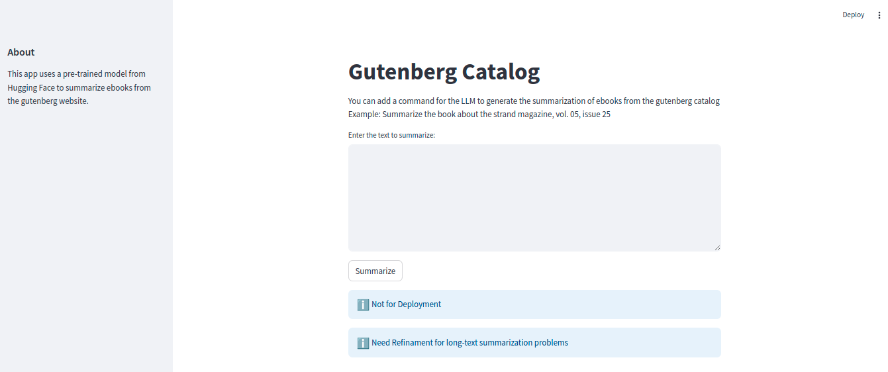

# PGC Assessment

This repo is created as a solution for an assessment with the objetive of Augment an LLM (large language model) using the Project Gutenberg Catalog to create book summaries.

## Clarifications:

- Local deployment only. No recommended to use in production environments.
- Dataset to finetune general model to Summarize: HuggingFace dataset `kmfoda/booksum`.
- Dataset to augment (RAG) is [Project Guten Berg](https://www.gutenberg.org/ebooks/offline_catalogs.html#xmlrdf)


## Task 

Solution for this project is to generate a local deployment for a summarization model. The model first will be fine tuned from a general Seq2Seq model to the NLP task Summarization. Then a model will RAG-Augmented by using the PGC dataset. Finally, the app will be deployed in a python app using streamlit.

The final model will be uploaded to hugging face hub.

## Problems

Summarization of books is a specific problem in summarization task, as it battles with the long texts. Normally, models like T5 or BART has input token max_lengths of 512-1024, if this numbers goes up, some problems can be faced in resources and the self-attention itself. To battle this, some models like Longformer and BigBird.

During the execution of this assessment, this problem was encounter, as the model selected is T5, which normally can be used for summarization as others like BART. In this case, the input max_lengh of 512 truncate the information and makes the model perform baddly.


## Dataset

- To fine-tune: [kmfoda/booksum](https://huggingface.co/datasets/kmfoda/booksum)
- A cleaned version: [ubaada/booksum-complete-cleaned](https://huggingface.co/datasets/ubaada/booksum-complete-cleaned)
- To RAG: [Gutenberg Catalog of ebooks](https://www.gutenberg.org/dirs/GUTINDEX.ALL)
- To Easily download to Rag [Gutenberg Langchain](https://python.langchain.com/v0.2/docs/integrations/document_loaders/gutenberg/)


## Steps done

### Environment

Create python environment and install the requirements as follows:

```
pip install -r requirements
```


### Download and preprocess gutenberg dataset from website.

You can do it by:

```
python download.py -d <dataset_folder> -c <number of random categories to download> -b <number of random books to select>
```

###### Note: download can also be implemented using langchain's gutenberg dataset download.
###### Note: download only english ebooks.

and 

```
python preprocess.py -d <dataset_folder> -v <version in format %Y%m%d%H%M%s>
```

After this, a folder with sufix `_preprocessed` will be created with the preprocessed dataset downloaded.

During preprocessing URLs, email and extra spaces are eliminated, and all the text is set to `lower`.


### Finetune T5 model

Check the `fine-tune-t5.ipynb` notebook.

booksum dataset is downloaded using transformers and used for finetuning during 10 epochs.

##### Note: here a problem was later found (long text summarization).

### RAG Pipeline

For the creation of the RAG pipeline, in `rag.py` a custom class is created to use the model T5. This follows the integrations in HuggingFace.

Next, the file `create_vector_db.py` is created for create de vector dababase with the dataset downloaded and preprocessed. Use:

```
python create_vector_db.py -m 'fnando1995/t5-small-ft-bookSum' -d data -v <%Y%m%d%H%M%S_processed>
```

The last argument is the version, normally with the processed sufix.


### App Deployment

A simple web app using streamlit is created and integrated with the custom class `RAGT5` created in `rag.py`.


Run with

```
streamlit run app.py fnando1995/t5-small-ft-bookSum data <%Y%m%d%H%M%S_processed> test_prompt.txt True
```

###### visualization


## Observations

Problems mentioned at section 'Problems' makes the model return not the appropiate.

Fine-tuning should be done for better metrics at the end.

Summarization with long-text have some strategies as chunking the long-texts and mixing each chunk summary. Using redundance between the chunks for the summary to have connectors.

T5 should be reconsider, as there are better models to handle long-text inputs like books.


